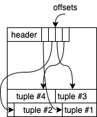
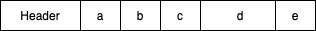
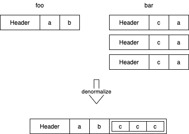
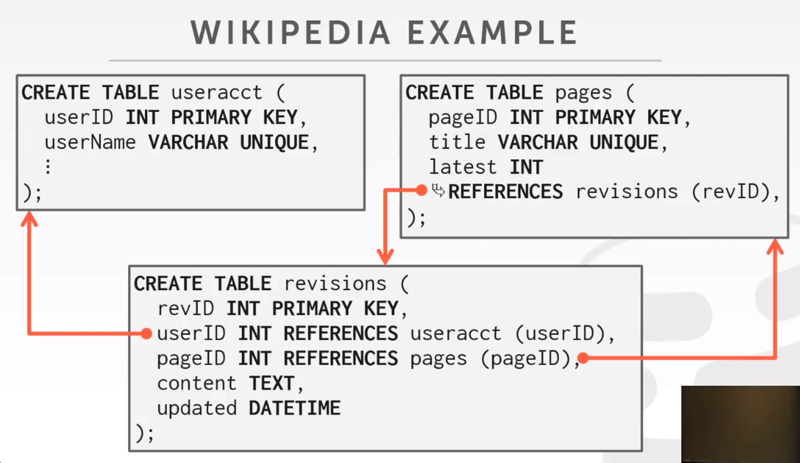
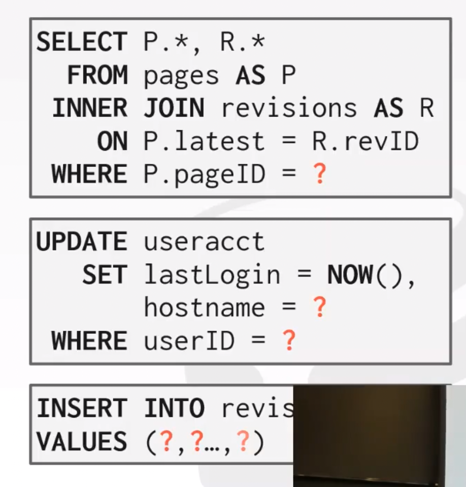
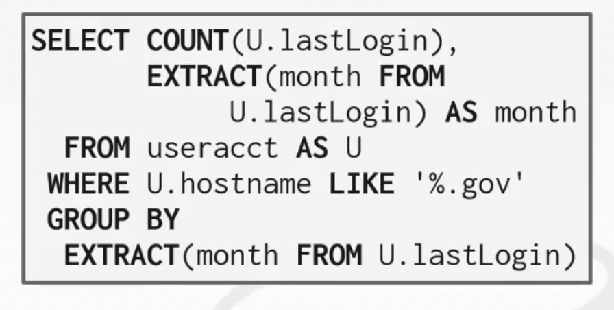
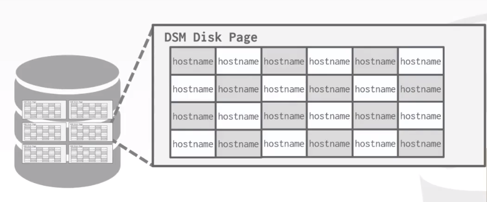
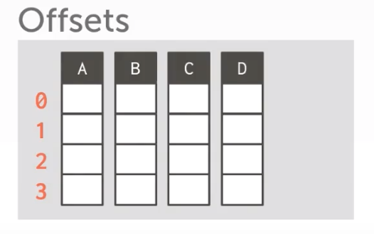
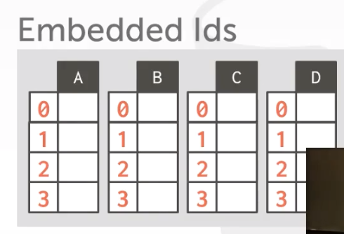

# Database System Note

Note to CMU 15-445 Database System

[Youtube to this Course](https://www.youtube.com/watch?v=1D81vXw2T_w&list=PLSE8ODhjZXjbohkNBWQs_otTrBTrjyohi&index=4)

[Chinese Translation Version](https://www.simtoco.com/#/albums/video?id=1000132)

## Class 1 : Relation Model

**Relation Algebra**

- 𝜎 Select
- 𝛱 Projection
- ∪ Union
- ∩ Intersection
- − Difference
- × Product
- ⋈ Join

**Extra Operators of Relation Algebra:**

- 𝞺 Rename
- R<-S Assignment
- 𝝳 Duplicate Elimination
- 𝝪 Aggregation
- 𝛕 Sorting
- r÷S Division

## Class 2: Advanced SQL

Relational algebra not only define the data we want, but also defined the order we do query.

But we dont exactly need to define an specifc order. User oly needs to dpecify the answer that they want, not how to compute it. That why we need advanced 

The DBMS is responsible for efficent evaluation of the query:

- Query optimizer: re-orders operations and generatews query plan

**History of SQL:**

- "SEQUEL" (Structured English Query Language) from IBM's **System R** prototype
- Oracle Adopted SEQUEL and IBM's DB2 in 1983 supports SEQUEL, so it become de facto standard
- "SQL" (Structured Query Language) become Standard in 1986(ANSI) and 1987(ISO)

### Relational Languages:

- Data Definition Language (DDL)
  - 用于定义DB的三级结构，包括外模式、概念模式、内模式和互相之间的映像。定义数据的完整性、安全控制等约束
  - 如 CREATE ALTER DROP TRUNCATE COMMENT RENAME
- Data Manipulation Language (DML)
  - 由DBMS提供，让用户和程序员实现对数据库中数据的操作
  - SELECT INSERT UPDATE DELETE MERGE CALL (EXPLAIN PLAN) (LOCK TABLE) 等
- Data Control Language (DCL)
  - 权限控制
  - GRANT REVOKE

**Aggregates:**

Functions that return a singel value from a bag of tuples:

- AVG(col) : Return the average col value
- MIN(col) : Return the minimum col value
- MAX(col) : Return maximun col value
- SUM(col) : Return sum of value in col
- COUNT(col) : Return # of values for col

Eg. we can only select **GROUP BY ed** col if we used aggregating fuctions. We can filter aggregated col with **HAVING** but not WHERE.

``` SQL
SELECT AVE(s.gpa) as ave_gpa, e.cid
FROM enrolled AS e, student AS s
WHERE e.sid = s.sid
GROUP BY e.cid
HAVING avg_gpa > 3.9;
```

**String Operation:**

Only MySQL is Case **Insensitive**, Only MySQL/SQLite supports Double Quotes. All the other DB is Case Sensitive and using Single Only Quotes.

**Date/Time Operations:**

Date operation differs from different DB.

**Output Control:**

ORDER BY \<col\> [ASC|DESC]
LIMIT \<count\> [OFFSET \<count\>]

**Nested Queries:**

eg.

``` SQL
SELECT name FROM student WHERE sid IN (SELECT sid FROM enrolled);

# or

SELECT (SELECT S.name FROM student AS S WHERE S.sid = E.sid) AS sname
FROM enrolled AS E
WHERE cid = '15-445';
```

## Class 3: Database Storage

**Different Level of Database System:**

- Query Planning
- Operator Execution
- Access Methods
- Buffer Pool Manager
- Disk Manager

**Disk-Oriented Architectur:** assumes that the primary storage location of database is on non-volatile disk. DBMS's components manage the movement of data between non-volatile and volatile storage.

**Time Cost of:**

- L1 Cache Ref: 0.5ns
- L2 Cache Ref: 7ns
- DRAM: 100ns
- SSD: 150,000ns
- HDD: 10,000,000ns
- Network Storage: 30,000,000ns

Some DB use **mmap** to use virtual memory (like levelDB LMDB). Some Partially use (like mongoDB SQLite). Moth main stream DB do not use (like MySQL, Oracle).

But, DBMS wants to control things itself and can do a better job (than OS) at it, like:

- Flushing ditry pages to disk in the correct order.
- Specialized prefetching.
- Buffer replacement plicy.
- Thread/process scheduling.

## For Database Storage

**Problem 1:** How the DBMS represents the database in files on disk.

**Problem 2:** How the DBMS manages its memory and move data back-and-forth from disk.

### File Storage

Most DB, espesically new DB in current years store database as one or more files on disk.

Early systems in 1980s use custom filesystems on raw storage.

### About Pages

There are three differeent notions of "pages" in a DBMS:

- Hardware Page (usually 4KB)
- OS Page (usually 4KB)
- Database Page (512B-16KB)
  - 4KB: SQLite DB2 Oracle
  - 8KB: SQL-Server PostgreSQL
  - 16KB: MySQL

### Tuple Page Storage



For example, if database want to store tuple into a page, it can have a list of offsets at the front of a page **(we call it slot)**, and use the offset to find the tuples from back of the page.

In PostgresDB, we can get the page-id and slot id by:

``` SQL
SELECT r.ctid, r.* FROM r

ctid   id   val
(0,1)  101  aaa
(0,2)  102  bbb
```

### Tuple Layout

the order of tuples (usually) depends on the order of CREATE.

Some DBMS can automatically re-order the attributes.

``` SQL
CREATE TABLE foo (
  a INT PRIMARY KEY,
  b INT NOT NULL,
  c INT,
  d DOUBLE,
  e FLOAT
)

```



We can also **denormalize (prejoin)** related tuples and store them together in same page.

e.g.: RethinkDB, CouchDB, RavenDB

``` SQL
CREATE TABLE foo (
  a INT PRIMARY KEY,
  b INT NOT NULL,
);

CREATE TABLE bar (
  c INT PRIMARY KEY,
  a INT REFERENCES foo(a),
);
```



It (denormalize) can:

- Potentially reduces the amount of I/O for common workload patterns.
- Can make updates more expensive.

**Record IDs:**

Each tuple is assigned a unique **record identifier**

- Most common: page_id + offset/slot
- Can also contain file location info
  
e.g.: PostgreSQL(CTID 4-bytes) SQLite(ROWID 8-bytes) ORACLE (ROWID)

An application **cannot** rely on these ids to mean anything because it will re-arrange automaticallly be DBMS.

### Log-Structured File Organization

Instead of storing tuples in pages, the DBMS oly stores **log records**

### Decimal

Decimal runs faster than fixpoint number, and, decimal number will not have persicion issue.

**Outer Files:**

Store the path of file in tuple and store the file in file system outside the tuple.

Also can use BLOB(Binary Large Object) to store file inside pages. Usually we only treat files smaller than 256KB using this method.

### Metadata

Metadata stores the schema info of a table.

Databases can use SQL cmd to get the metadata of a table.

### Database Storage Models



**OLTP:** On-line Transaction Processing

- Simple queries that read/update a small amount of data that is related to a single entity in the database.

e.g.: 

**OLAP:** On-line Analytical Processing

- Complex queries that read large portions of the database spanning multiple entities.

e.g.: 

**Decomposition Storage Model (DSM):**

The DBMS stores the values of a single attribute for all tuples contiguously in a page. Known as a "column store".



**Column Storge Tuple Identifications:**

Choice 1: Fixed-length Offsets

Each value have a same length.



Choice 2: Embedded Ids

Each value is stored with its tuple id. (Rarely used recently)



OLTP = Row Store

OLAP = Column Store

**Two main problem of Database Storage：**

- #1: How the DBMS represents the database in files on disk. (This section)
- #2: How the DBMS manage its memory and move data back-and-forth from disk. (Next section: Buffer Pools)

## Buffer Pools

**Locks vs. Latches:**

Locks:

- Protects the database's logical contents from other transations.
- Held for transactions duration.
- Need to be able to rollback changes.

Latches (Mutex):

- Protects the critical sections of the DBMS's internal data structrue from other threads
- Held for operation duration
- Do not need to be able to roll back changes

